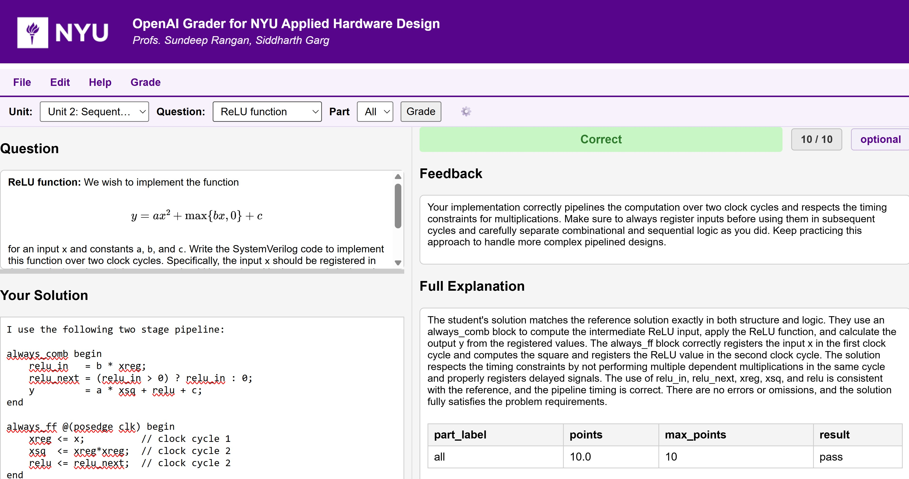

# LLM Grader

LLM Grader is an open‑source, AI‑native autograding engine designed for modern engineering education. It brings together structured problem definitions, model‑driven reasoning, and optional tool‑augmented evaluation (including Python execution and web‑search‑assisted verification) to create a grading workflow that is fast, transparent, and deeply extensible.

---

### What LLM Grader Aims to Solve
Traditional autograders work beautifully for programming assignments but struggle with engineering reasoning: multi‑step derivations, design tradeoffs, approximations, and open‑ended justification. LLM Grader is built for exactly these cases. It treats grading as a *dialogue with the student’s reasoning*, not just a comparison against a reference output.

The system is intentionally lightweight — a small core that instructors can understand, modify, and extend — but powerful enough to support real courses today.

---

### Core Capabilities

- **Structured problem definitions** that capture instructor intent, reference solutions, rubrics, and grading notes across engineering domains.  
- **LLM‑based evaluation** of student reasoning using OpenAI models, with optional tool‑assisted checks (Python execution, numeric verification, and web‑search‑augmented fact checking).  
- **Flexible scoring logic** that instructors can customize, inspect, and iterate on.  
- **Seamless export to Gradescope**, including a standalone autograder that requires no LLM calls during grading.  
- **Transparent, inspectable grading traces** so instructors can see *why* the model awarded points.
- **Tool‑augmented evaluation**, including web‑search‑based retrieval of external artifacts (e.g., student GitHub repos, hosted figures, or reference materials) and, in the near future, optional Python execution for numeric checks.

---

### Research‑Driven and Open Source
LLM Grader is early‑stage, evolving quickly, and intentionally open. It is designed for instructors, researchers, and developers who want to explore:

- How LLMs reason about engineering problems  
- How tool‑augmented models change grading reliability  
- How to build reproducible, AI‑native assessment pipelines  
- How to integrate LLM feedback into student learning loops  

Contributions, critiques, and experiments are all welcome.

---

### People
LLM Grader is developed by [Sundeep Rangan](https://wireless.engineering.nyu.edu/sundeep-rangan/), Professor of Electrical and Computer Engineering at NYU and Director of NYU Wireless.

---

### Try It in a Real Course

The tool is currently being piloted in [**Introduction to Hardware Design**](https://sdrangan.github.io/hwdesign/docs/), an entry‑level MS course at NYU for students with no prior hardware background. Students use the grader to iterate on their solutions in a *try → grade → improve* loop, receiving immediate, model‑driven feedback.  It is also being used
as a part of new [AI-driven project workflow](https://sdrangan.github.io/hwdesign/docs/projects/ai_workflow.html).

You’re invited to explore the grader, test the examples, and share your thoughts — especially what feels promising and what still needs work.