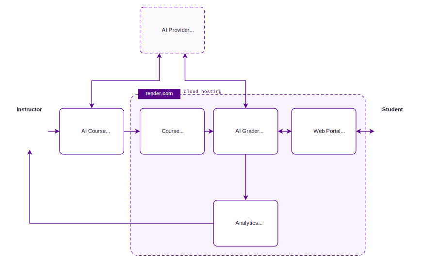

## Core Components of LLM Grader

The architecture for the LLM grader is shown above and has the following core components.

### Course package

The course package is the instructor-authored source of truth. It includes:

- questions
- reference solutions
- grading rubrics
- grading notes
- packaging metadata and assets

These are stored in a structured XML format so the grading behavior is explicit, inspectable, and versionable. The XML is detailed enough to support both binary and partial-credit grading, multipart questions, instructor notes, and packaged images or other assets.

The benefit of this structure is that instructors are not handing grading over to an opaque prompt. They are defining the question and grading intent in a format that can be validated, reused, and improved over time.

### AI course builder

To assist instructors in writing the XML files for the course package, LLM Grader is currently developing an MCP-based authoring assistant for instructors working in Visual Studio Code. This agent can help with:

- scanning the workspace for likely course-authoring inputs
- drafting configuration and drafting unit XML questions
- suggesting an authoring plan before drafting more complex questions
- retrieving example questions from a RAG
- validating the resulting XML before it is packaged

This matters because authoring structured grading content is powerful, but it can also be tedious if done entirely by hand. The MCP workflow is designed to accelerate the first draft while still keeping the instructor in control.

### Web portal

LLM Grader includes a lightweight Flask-based portal where students can:

- view assigned questions
- submit responses
- receive grading feedback
- iterate on their work in a try, grade, and improve loop

For instructors, this creates a usable front end without requiring a large learning platform integration up front. It is intentionally lightweight so departments or individual faculty can pilot the system without a heavy deployment burden.

### Back-end AI grader service

The grading service uses LLM-based evaluation to compare student work against the instructor's solution, grading notes, and rubric definitions. This is where LLM Grader differs most from conventional autograders.

It is intended for problems where the work matters, not just the final answer. Depending on the question design, the grader can evaluate:

- whether the student used a valid method
- whether intermediate reasoning is mathematically or technically sound
- whether the final result is correct
- whether partial credit should be awarded for substantial progress

The grading logic is guided by the structured authoring data, which makes the grading process more transparent and more controllable than a free-form prompt-only approach.

### Analytics and grading records

LLM Grader is also designed to support analytics and operational visibility. Over time, this can help instructors understand:

- where students are struggling
- which rubric items are frequently triggered
- how grading patterns differ across questions or cohorts
- where question wording or grading guidance may need improvement

The analytics layer is still evolving, but it is part of the overall design goal: grading should not just assign a score, it should generate insight for course improvement.